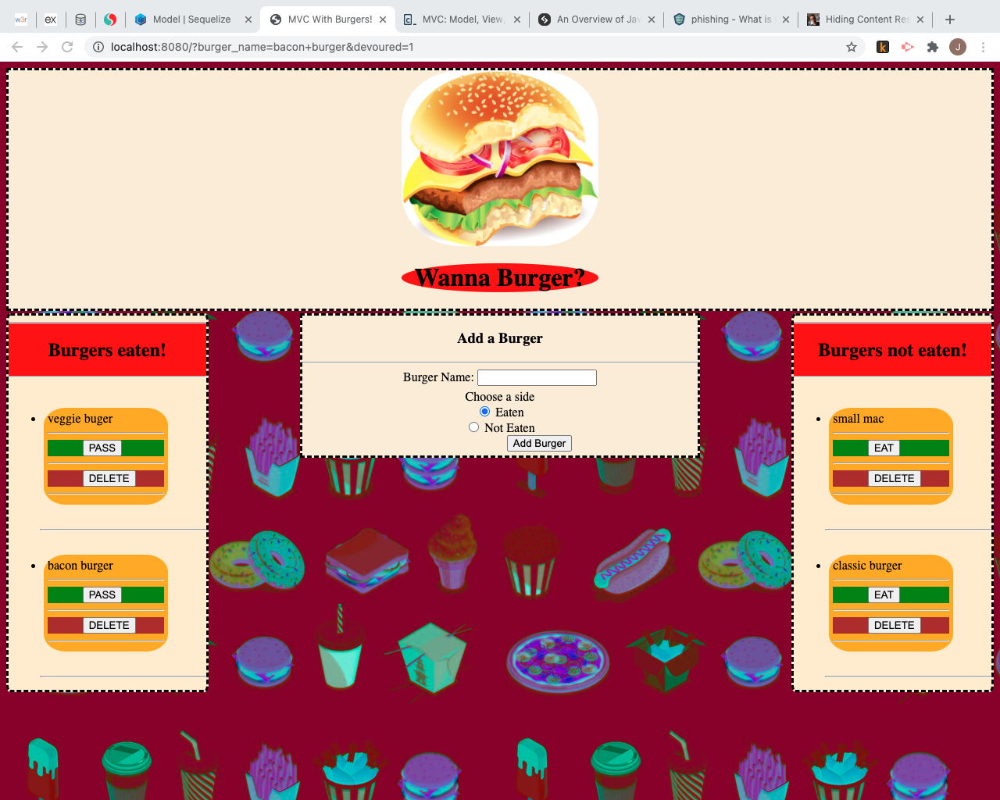

# Wanna Burger?

---
# Description

Create a burger logger with MySQL, Node, Express, Handlebars and a homemade ORM. Using the MVC design pattern, Node and MySQL will be used to query and route data while handlebars will be used to generate HTML.

---

## Preview

![Link] (https://jjg1488.github.io/burger/)

---

## Table of Contents

[Description of Application](#description)

[How to Install](#installation)

[How to Use](#usage)

[How to Contribute](#contributing)

[Contact Information](#questions)

---
# Installation

Clone the repository, add the repository to your folder, open the application in the IDE of your choosing,run npm install in the terminal.

---
 # Usage

The application uses a database to store the information that the user enters. The user is able to add a item to whichever side of the application that the user decides, and based on the side selected, the information is stored in the databases's table and displayed to the appropriate column or area.

---
# Contributing

Contact me via email or in git hub

---
# Questions

jamesgault1488@gmail.com

JJG1488

contact me via email or github 

